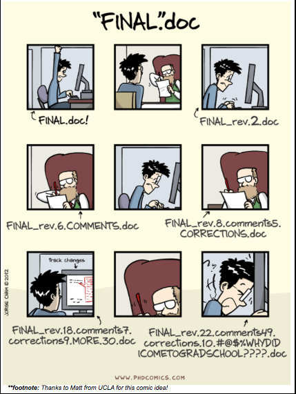

# GitHub Classroom Template

Hello and welcome! You have just created your very own GitHub classroom repository. 

There is one important rule here: **stage + commit + push = submit**!

If this does not make sense yet, don't worry and read on. :) Make sure to carefully read the section on [submitting your solutions](https://github.com/iwh-halle/Template?tab=readme-ov-file#submitting-your-solutions) below.


## Fundamentals of Git and GitHub


### Git (local repository)
> Git is a free and open source distributed version control system designed to handle everything from small to very large projects with speed and efficiency. [(see Git, 2023)](https://git-scm.com/)

Your local repository is essentially a folder on your local file system. Changes made in that folder can be committed to the (local) git repository.  This involves two steps:

First, stage your changes - this is sth. like a pre-commit:

```Bash
git add *  # '*' adds all changes made in your local folder
```

Second, commit your staged changes to the local repository:
```Bash
git commit -m 'Commit message'
```

More on Git:

* Simple guide: https://rogerdudler.github.io/git-guide/
* About Git itself: https://git-scm.com/about
* Getting started (videos, tutorials): https://git-scm.com/doc

### GitHub (remote repository)

You can `clone` the course repository to your local system:

```Bash
git clone [repository url]
```

Your local Git repository remembers its origins. This enables you to `pull` updates from the remote (Git does not synchronize automatically). 

```Bash
git pull
```

If you have write access to the remote, you can also `push` changes to it.

```Bash
git push
```

Careful: Git tries its best to merge the remote with the local repository, however, might fail if the two repositories are 'too' diverging. This should not concern you too much as a single user, but becomes very relevant when collaborating on a remote.

This is all we need for now, however, it is only the tip of the iceberg. More on GitHub:

* Working with GitHub (remotes): https://skills.github.com/


## Working with Codespaces

If you have your own coding setup going on, feel free to skip to the next section. Codespaces provides you with a nice interactive development environment (IDE), without the need to install Python on your local machine. Better yet, Codespaces can directly link to your classroom repository and enable you to use Git as described above. To activate your Codespace:

1. Go to the landing page of your classroom repository,
2. Click on the green "<> Code" button,
3. Create a Codespace under the "Codespaces" tab.

Carefully note that codespaces do not live forever; you still need Git in order to save your work, i.e., **stage + commit + push**! Luckily, Git integrates very nicely with Codespaces.

By the way, Codespaces is essentially a browser-based version of [Visual Studio Code](https://code.visualstudio.com/), a powerful and free-to-use code editor/IDE.


## Submitting your solutions

Reading this you have likely received a GitHub Classroom link, which means that you have already created your very own GitHub repository. You can interact with this repository using Codespaces (see above) or by ``git clone`` this repository to your personal computer. You can then start working on your solutions. If you are happy with your changes, ``git commit`` and ``git push`` the changes back to the remote repository. All the changes pushed to the remote repository before the deadline will be counted towards your submission, hence: **commit + push = submit**!

Here is a quick reference for the most important commands: [git_cheat_sheet.pdf](https://github.com/iwh-halle/Template/blob/main/git_cheat_sheet.pdf)


## Coding style

Without being too pedantic, we follow the [PEP 8 – Style Guide for Python Code](https://peps.python.org/pep-0008/). When in doubt, return to this source for guidance.

### Naming convention

Here are some best practices to follow when naming stuff.
* Use all lowercase. E.g.: `name` instead of `Name`
* One exception: class names should start with a capital letter and follow by lowercase letters, e.g. `Student`.
* Use snake_case convention (i.e., separate words by underscores, look like a snake). E.g.: ``gross_profit`` instead of ``grossProfit`` or ``GrossProfit``.
* Meaningful and easy to remember. E.g.: ``interest_rate`` instead of ``r`` or ``ir``.
* Reasonable length. E.g.: ``sales_apr`` instead of ``sales_data_for_april``
* Avoid names of popular functions and modules. E.g.: avoid ``print``, ``math``, or ``collections``.

### Comments

Comments should help to understand how your code works and your intentions behind it! 

> Comments that contradict the code are worse than no comments. Always make a priority of keeping the comments up-to-date when the code changes! Comments should be complete sentences. The first word should be capitalized, unless it is an identifier that begins with a lower case letter (never alter the case of identifiers!). [(PEP 8)](https://peps.python.org/pep-0008/#comments)


## Resources

* [git_cheat_sheet.pdf](https://github.com/iwh-halle/Template/blob/main/git_cheat_sheet.pdf)
* http://rogerdudler.github.io/git-guide/
* https://guides.github.com/
* https://git-scm.com/book/en/v2
* https://peps.python.org/pep-0008/


## Why Git?!


